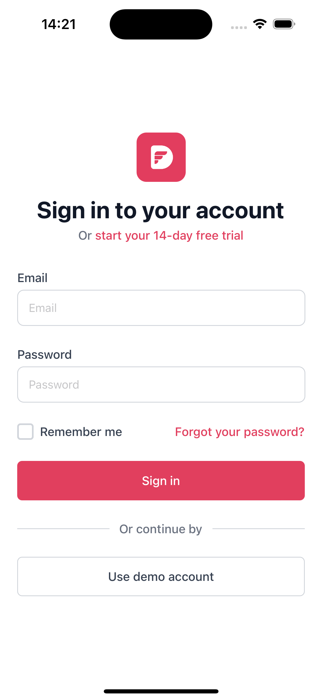

# Dwarves React Native boilerplate

### This project is a React Native boilerplate that can be used to kickstart a mobile application with React Native.

Package manager we use: yarn

## Requirements

Node 16 or greater is required. Development for iOS requires a Mac and Xcode 13 or up, and will target iOS 13 and up.

You also need to install the dependencies required by React Native.  
Go to the [React Native environment setup](https://reactnative.dev/docs/environment-setup), then select `React Native CLI Quickstart` tab.  
Follow instructions for your given `development OS` and `target OS`.

## Development Setup

1. Follow and make sure to setup development environment for react-native-cli [here](https://reactnative.dev/docs/0.70/environment-setup). To confirm is setup is properly working, create/initialize a new app to test.
2. Make sure to setup required node version under `.node-version` file. It is also better to have node version manager because react native v0.70 is using node 16 while react native v0.71 is using node 18.
3. Make sure to setup a ruby version manager as React Native CLI iOS is now heavily dependent of Ruby,thus it is important to easily switch ruby version across upgrades and updates. Make sure to install the ruby version found in `.ruby-version` file as well.
4. Run `bundle install` to setup iOS gemfile dependencies.
5. Run `yarn` to install app dependencies.
6. Run `npx pod-install` to install Pod dependencies.
7. Run `yarn ios` (to start app in iOS) or `yarn android` (for android).

    

## Documentation

- [Getting started](./docs/GETTING_STARTED.md)
- [Tech ecosystem](./docs/TECH_ECOSYSTEM.md)
- [Code style](./docs/CODE_STYLE.md)
- [Writing tests](./docs/WRITING_TEST.md)
- [Editor](./docs/EDITOR.md)
- [Deployment](./docs/DEPLOYMENT.md)
